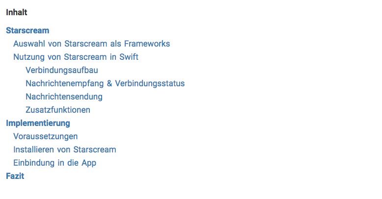
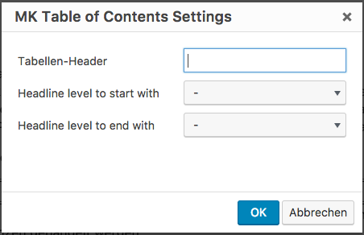
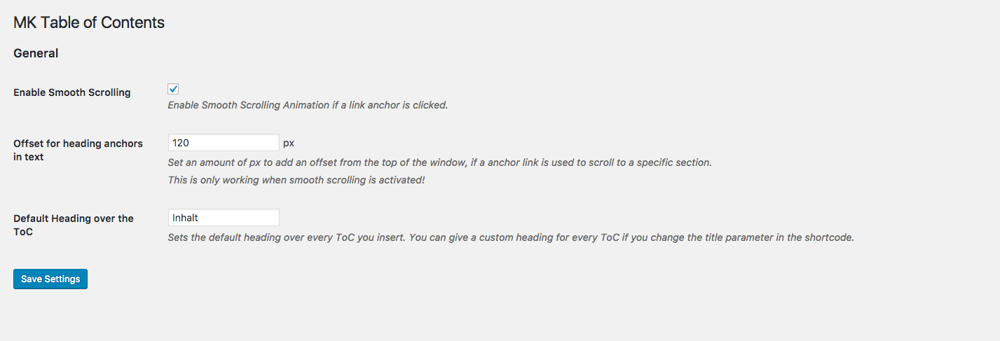

# MK Table of Contents Plugin

This Plugin adds a Table of Contents to a post via inserting the shortcode [toc]. For a easy usablitity of the shortcode, the plugin adds a button to the TinyMCE Editor. Together with the extra button, there is a dialog which allows to configure the inserted Table of Contents and the shortcode.

The Plugin also provides some general settings which the user can set in the admin area.

Look also at [http://blog.moritzkanzler.de/portfolio/mk-table-of-contents/](http://blog.moritzkanzler.de/portfolio/mk-table-of-contents/) for more informations.

**This Plugin is still in development and not stable!**

## Appearance



## Installation
There will be serveral ways to install this plugin. For now there is only the way to get it from this repository.
### Download
Clone or Download the plugin from this repository and upload it in your WordPress instance under ```wp-content/plugins/mk-toc```. When you open the plugin section in your WordPress Admin Panel, you will see the plugin and just have to activate it.

For every update of the plugin you have to download and then upload the new versions again.

## Usage
This plugin creates a Table of Contents for a post at the position in text where the shortcode [toc] is inserted with the following rules:
* The shortcode generates the ToC only from the post content. 
* It scans all headings (```<h1>```...```<h5>```) and orders them on their appearance in the text.
* It will output a list with the generated ToC and put it at the position in text where the shortcode was set.
* All ToC recognized headings are shown as links with anchors to their appropriate heading in the text.
* A JavaScript part of the plugin also add anchor links above every recognized heading in the post content to make the anchor links work.
* Except the shortcode [toc] the plugin generates no changes in post content or other parts of the post. So it is no problem to deactivate the plugin.

## Shortcode
The shortcode [toc], introduced with this plugin, can have several option parameters:
* **title** (*optional*): This parameters takes a string and if its not emtpy it will show a headline above the generated ToC.
* **level_begin** (*optional*): *level_begin* determine at which heading level the ToC parsing should start. Cases can be that you want to exclude headings like ```<h1>```. The default behavoir is, that the ToC recognize all headings from ```<h1>``` to ```<h5>```.
* **level_end** (*optional*): *level_end* has the same functionality like *level_begin* but it limited the headings level from underneath. So you can determine that the ToC doesn't handle headings underneath level ```<h4>``` for example.

So a full toc shortcode could look like this: ```[toc title="My Headings" level_begin="2" level_end="4"]```

## TinyMCE

Because there are many shortcodes around in WordPress and no one can know them all it is easier to just use a button in the RTE of WordPress (TinyMCE) to generate a shortcode like **[toc]**.
 
To do so, the plugin adds an button in the first row of the TinyMCE (only on posts) which will open a dialog. In this dialog the three parameters from above can be choose and after clicking "OK" the plugin will generate the shortcode **[toc]** with the choosen parameters at the cursor position in the text.



## Settings

There are some general settings which can be set:
* **Enable Smooth Scrolling**: If this option is "on" there will be a smooth scrolling animation if a user clicks on an anchor link in the ToC. It also sets the browser history right. If you turn it off the link anchor works just like a normal anchor in the web.
* **Offset for heading anchors in text**: If *Smooth Scrolling* is enabled, this option controls how much offset will be added to the smooth scroll animation. This means that the clicked headline does not appear at the top of the browser window, but on the top plus the choosen offset. This is just for cosmetic purposes, but it can be really helpfull if your site uses a fixed header or something on top of content.
* **Default Heading over the ToC**: If you dont enter any title in the ToC Shortcode settings, the title choosen in this option will be shown on top of the ToC.

